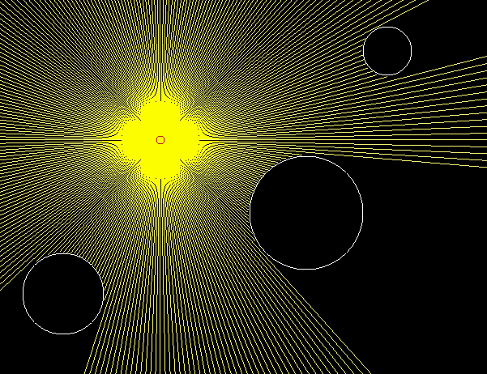

# hengine

Small game library I made to practice C and learn OpenGL. The library is built on GLFW and can drawing basic sprites (with sprite batching), lines and other primitives.

## Demo Raycasting App

Made using the library: 

## Dependencies 

- mesa-common-dev
- libglfw3
- libglfw3-dev
